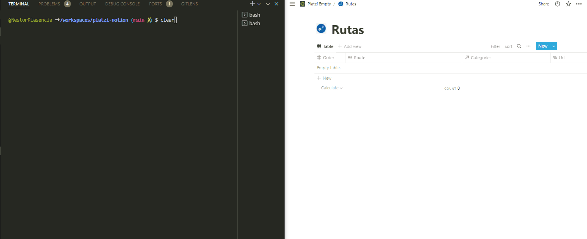

# Platzi Notion Notes

## 1. Duplicar Template

Este proyecto permite generar 3 Databases en Notion (Categorías, Rutas y Cursos) con la información de la plataforma Platzi, esto permite tener un template en notion donde tomar tus apuntes de los cursos que vayas realizando en la plataforma.

Si aun no tienes manejo de la herramienta Notion puedes apuntarte al curso

[Curso de Organización y Productividad con Notion](https://platzi.com/cursos/notion/)

> Puedes duplicar este template con toda la información ya completada.
> [Template con información completa al 09/05/2022 ](https://www.notion.so/nestcode/Platzi-2e012bf2af8e4024b78ad014d9c433e1)


o

> Puedes duplicar este template vació y que va ha ser completado con la información actual de la plataforma.
> [Template vació](https://www.notion.so/nestcode/Platzi-Empty-4ec749003f1443e4afcf91a6badd7bf2)


## 2. Completar el template vació

Para completar el template vació haremos uso del presente repositorio, usando NodeJS y el API de Notion.



### 2.1 Obtener Internal Integration Token de Notion

- Ve a [https://www.notion.com/my-integrations](https://www.notion.com/my-integrations).
- Click en el botón "+ New integration" .
- Da un nombre a tu integración - I chose "PlatziNotion".
- Selecciona el workspace donde vas a instalar la integración.
- Selecciona las capacidades que obtendrá la integración.
- Click en "Submit" para crear la integración
- Copia el "Internal Integration Token" de la siguiente página.


### 2.2 Comparte las Databases ( Categorías, Rutas y Cursos ) con la integración

Al principio, las integraciones no tienen acceso a ninguna página (o base de datos) del workspace. Un usuario debe compartir páginas específicas con una integración para que se pueda acceder a esas páginas mediante la API.

En cada una de las Databases haz clic en el botón "Share" y utiliza el selector para encontrar tu integración por su nombre, luego haz clic en "Invite".


> Imágenes referenciales obtenidas de [https://developers.notion.com/docs/getting-started](https://developers.notion.com/docs/getting-started)

### 2.3 Clona el proyecto

```
git clone https://github.com/NestorPlasencia/platzi-notion.git
```

### 2.4 Instala las dependencias

```
npm -i
```

### 2.5 Renombra el archivo .env.template por .env

```
mv .env.template .env
```

### 2.6 Extrae los ids de las Databases información 

El ID de la base de datos es la parte de la URL que aparece después del nombre de su espacio de trabajo (si tiene uno) y la barra (/) y antes del signo de interrogación (?). El ID tiene 32 caracteres y contiene números y letras.

```
https://www.notion.so/myworkspace/a8aec43384f447ed84390e8e42c2e089?v=...
                                  |--------- Database ID --------|
```

### 2.7 Reemplazar la información en el archivo .env

```
NOTION_KEY=secret_...
NOTION_COURSES_DB_ID=...
NOTION_ROUTES_DB_ID=...
NOTION_CATEGORIES_DB_ID=...
```

### 2.8 Correr el script de Node.Js

```
node index.js
```


